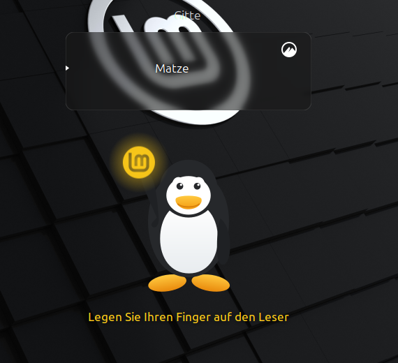

# How it works

***English** · [Deutsch](HOW-IT-WORKS.de.md)*

## What goes wrong in the stock greeter

Fingerprint login works in slick-greeter, but three things go wrong, all from
one cause: `pam_fprintd`'s messages are routed into the user entry's message
list, which was built for something else.

- **They stack up**, one line per attempt and per hint.
- **They arrive in English**, whatever the system locale says. `lightdm` never
  calls `setlocale()`, so `pam_fprintd`'s own `gettext()` returns the
  untranslated text, and no locale setting fixes that from the outside.
  [`LINUX-MINT.md`](LINUX-MINT.md) has the measurements.
- **They block the login.** Every message sets `unacknowledged_messages`, and
  that flag is exactly what stops `authentication_complete_cb()` from starting
  the session — so a successful scan left you looking at a Log In button.

## The panel

Fingerprint messages go to a panel of their own, centred under the user list,
showing exactly one message at a time:

| State | What you see |
| --- | --- |
| Waiting | Mint logo glows yellow, breathing |
| Rejected | Logo flashes red for 1.5 s, then back to waiting |
| Recognised | Logo glows green for 1.5 s, then the session starts |
| Reader gave up | Tux swaps the logo for a "Password:" sign |

The name of the user being authenticated glows in the same colour, so the two
read as one signal.

A flash owns the panel for its full 1.5 s, and a message arriving meanwhile is
shown when the flash ends. Without that the red was never visible:
`pam_fprintd` sends "Failed to match fingerprint" and the next "Place your
finger" in the same breath.

The password state is driven by PAM, not by counting attempts. A password prompt
arriving after the reader has been talking means `pam_fprintd` used up its
`max-tries`; the box then grows its password row, exactly as PAM asks for it.

## Messages

PAM messages carry no marker saying where they came from, so the panel
recognises `pam_fprintd`'s by their text — matched in English, because that is
what arrives at the login screen. What is shown comes from this project's own
gettext catalogue, with English as the base and fallback, so it does not depend
on a fprintd translation being installed. See [`TRANSLATIONS.md`](TRANSLATIONS.md).

Anything that is not about the reader reaches the greeter's message list as
before.

## Smaller fixes in upstream layout code

- User names are centred in their entry rather than pinned to its top-left
  corner.
- The active-session marker is centred on the whole box instead of its first
  row, which stops being the middle once the box grows a password row.

## Configuration

greeter-fprint reads exactly what slick-greeter reads — the `x.dm.slick-greeter`
schema and `/etc/lightdm/slick-greeter.conf` — so an existing setup applies
unchanged.

## The whole screen

The animation in the README is cropped to the user list and the panel. This is
a screenshot of the real thing — LightDM, PAM and the reader — in a nested
LightDM seat:

